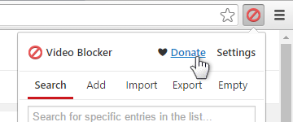

Journey's YouTube Video Blocker - YouTube Video Blocker fork for Chrome and Chrome-like things

## Notice!

As of 4/24/17 This extension will be on the back burner until further notice as the [extension](https://chrome.google.com/webstore/detail/video-blocker/jknkjnpcbbgcbdbaampbjlhkcghmgfhk?hl=en) this is based off of has starting working again, if said extension stops working in the future I will resume working on this once again.

--

If in need of an extension that works on the newest youtube design until I can get around to updating this, you can take a look at this [extension](https://chrome.google.com/webstore/detail/keyword-blocker/pbgacppomjfpheddhifkdkklddnolnpg) it does everything that Video Blocker does plus a bit more, and it works on the latest youtube design. 

## Releases

At the Current time there are no releases scheduled for chrome store. Sorry

## Screenshot

## What is this

Journey's YouTube Video Blocker is an extension that is based off of [Video Blocker](https://chrome.google.com/webstore/detail/video-blocker/jknkjnpcbbgcbdbaampbjlhkcghmgfhk?hl=en) to get things working again as the extension stopped working on 4/20/17 and the developer had disappeared off the face of the planet. My plans are to keep this extension alive and working for as long as possible.

## what Does it do

Journey's YouTube Video Blocker allows you to hide videos from channels that you don't like. You can specify these channels by right-clicking on a link to a video on YouTube or by adding them manually via the options page. You can also hide videos from multiple channels at once, by using a wildcard or adding regular expressions. Blocking videos with certain keywords in their title is also possible! For more information on how to do this exactly, please visit the help section at the settings after installing this extension. Every item you add to your block-list can now also be protected with a password!

## Contributing

The source is hosted on [GitHub](https://github.com/JourneyOver/Youtube-Video-Blocker) and pull requests are welcome.

## How to install manually [only way for now]

First method -- Some chrome based browsers do not support this method anymore so you will have to resort to the second method to install the extension.
1. Go to [Releases](https://github.com/JourneyOver/Youtube-Video-Blocker/releases)
2. Download the latest .crx
3. In Chrome, navigate to chrome://extensions
4. Drag and drop the .crx file anywhere on the page and when it asks if you want to install it click yes
5. The extension should be installed! You should now see it in the list of your extensions, and it’s icon will be in the Chrome menu. That’s it! Super painless
6. You can delete the .crx file as it's safe to delete now.
7. If you would like to keep your settings, click the old version of the extension and click on export and export the .json anywhere.
8. Go to the new version of the extension and click on import and import the .json you just made.

Or second method --

1. look for the green “Clone or download” button
2. Click the “Clone or download” button and then click “Download ZIP.”
3. Take the downloaded ZIP file and extract its contents somewhere safe like "%localappdata%\google\chrome". (if the files get moved/deleted then the extension will stop working).
4. With the extension downloaded and extracted, you can now install it.In Chrome, navigate to chrome://extensions
5. Installing the extension is extremely easy. All you need to do is drag-and-drop the folder you extracted onto Chrome’s Extensions page.
6. The extension should be installed! You should now see it in the list of your extensions, and it’s icon will be in the Chrome menu. That’s it! Super painless
7. If you would like to keep your settings, click the old version of the extension and click on export and export the .json anywhere.
8. Go to the new version of the extension and click on import and import the .json you just made.

## How to update

If you have downloaded the .crx file of the extension, it will automatically update.

If you did it with the second method then follow the steps below.

1. Follow steps 1 & 2.
2. Take the downloaded Zip file and extract its contents into the folder from step 3 above
3. when asked if you want to replace files click yes
4. In Chrome, navigate to chrome://extensions and click reload on the extension (or press CTRL + R)

## License

Copyright (C) 2012-2016 Lemonrice

Copyright (C) 2017 Journey Over

This program is free software: you can redistribute it and/or modify
it under the terms of the GNU General Public License as published by
the Free Software Foundation, either version 3 of the License, or
(at your option) any later version.

This program is distributed in the hope that it will be useful,
but WITHOUT ANY WARRANTY; without even the implied warranty of
MERCHANTABILITY or FITNESS FOR A PARTICULAR PURPOSE.  See the
GNU General Public License for more details.

You should have received a copy of the GNU General Public License
along with this program.  If not, see <http://www.gnu.org/licenses/>.
